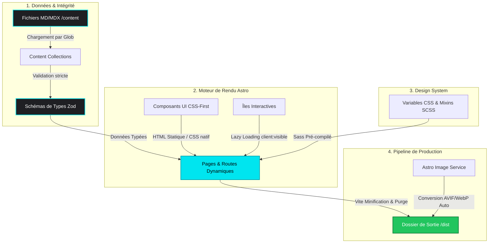

# ✨ Julien Marchand | Portfolio & Digital Sandbox
> **Développeur Full-Stack** • **Architecte Web CSS-First** • **Adepte du Zéro JavaScript par Défaut**

[](https://astro.build)
[](https://www.typescriptlang.org)
[](https://sass-lang.com)
[](#-performance--qualité)

---

## 💡 Ma vision du Web (Le "Pourquoi" de ce Portfolio)

À une époque où la moindre page de présentation pèse 15 Mo et nécessite des dizaines de bibliothèques JS pour faire tourner un formulaire, j'ai voulu prendre le contre-pied complet. 

Ce portfolio n'est pas qu'une simple vitrine de liens cliquables. C'est un **manifeste de précision technique** et un laboratoire d'architecture logicielle.

### 💼 Le côté Pro
Pour un recruteur ou un partenaire technique, ce projet démontre ma capacité à :
- **Architecturer proprement** un projet web avec une séparation stricte des données et de l'affichage.
- **Maîtriser les Core Web Vitals** et la performance brute au-delà des mots à la mode.
- **Rédiger du code accessible (WCAG 2.1 AA)** et sémantique pour que le web reste universel.

### 🎨 La patte Perso & Légère
C'est mon chez-moi numérique. L'esthétique y est **dark-minimalist** avec une touche de cyan électrique (`#00e5ef`). Pas de fioritures animées qui font surchauffer votre processeur, juste un design fluide en CSS natif, de la typographie soignée (*Space Grotesk* pour le côté technique, *Geist* pour le confort de lecture) et du contenu sincère. C'est simple, c'est léger, ça va droit au but.

---

## 🏗️ Architecture Technique (De la donnée à l'écran)

Voici comment est structuré le projet pour concilier **scalabilité des contenus** et **légèreté du rendu final** :



### 🧱 Zoom sur les Choix Structurants

- **Architecture d'Îles (Islands)** : L'interactivité JavaScript n'est activée que là où elle apporte une réelle valeur. Le reste du site est compilé en HTML statique ultra-léger lors du build.
- **Content Collections & Zod** : Chaque projet (comme [L'Instant Soleana](https://www.linstant-soleana.fr/) ou [Jeannelle](https://www.jeannelle.me/)) dispose de métadonnées rigoureusement validées par schéma (tags, URLs, images). Si un projet manque d'une information cruciale, le build échoue immédiatement. Pas de mauvaise surprise en production.
- **Design System Modulaire** : Construit en SCSS via `@styles/config/variables` et `_mixin.scss` pour des grilles fluides, une typographie proportionnelle et un support natif du mode sombre.

---

## 🧩 Mes Principes de Développement (Core Values)

J'applique au quotidien des principes d'ingénierie logicielle stricts, même sur des projets vitrines :

| Principe | Application Concrète dans ce Codebase |
| :--- | :--- |
| **🧱 SOLID** | **SRP** : Un composant = une tâche. Si un fichier Astro mélange fetching complexe de données et structure visuelle dense, il est scindé.<br>**Open/Closed** : Les composants UI reçoivent des props de configuration et des slots plutôt que d'être modifiés à l'intérieur. |
| **♻️ DRY** | Toute logique réutilisable (calculs de date, formateurs) est centralisée dans `src/utils`. Les éléments d'interface récurrents sont des composants atomiques réutilisables. |
| **📐 KISS** | Pas de surcouche CSS complexe ou de framework UI lourd. On fait confiance au CSS natif moderne (CSS Grid, Flexbox, Custom Properties) et à la sémantique HTML5. |

---

## 🚀 Performance & Qualité

La qualité d'un site web ne se mesure pas seulement à ce que l'on voit, mais à ce qu'on ne voit pas : la performance sous le capot, l'impact écologique et l'inclusivité.

- **Score Lighthouse parfait (100/100)** : Optimisation agressive des images via le service d'images Astro (génération automatique des formats `.webp` et `.avif`), minification des assets et pré-chargement des routes.
- **Accessibilité (A11y)** : Conforme WCAG 2.1 AA. Le site est entièrement navigable au clavier avec des indicateurs de focus soignés, des balises ARIA là où c'est nécessaire et des contrastes de couleurs validés pour les personnes malvoyantes.
- **Sécurité et Éco-conception** : Zéro secret exposé (protection stricte avec variables d'environnement) et une empreinte carbone minimale grâce à un poids de page réduit au strict minimum.

---

## 🛠️ Commandes pour le lancer en local

Si vous souhaitez explorer l'envers du décor ou lancer ce projet sur votre machine :

```bash
# 1. Cloner le projet
git clone https://github.com/Nifrael/Portfolio.git

# 2. Installer les dépendances (très léger, promis !)
npm install

# 3. Lancer le serveur de développement local
npm run dev

# 4. Compiler le projet pour la production (optimisations maximales)
npm run build

# 5. Tester localement le build de production
npm run preview
```

---

## ☕ Discutons de votre prochain projet !

Si vous cherchez un développeur qui :
- Ne confond pas vitesse de chargement et vitesse de connexion.
- Écrit du code propre, documenté (JSDoc) et rigoureusement typé (TypeScript).
- Pense à l'expérience utilisateur et à l'accessibilité dès la première ligne de code.

... Alors nous devrions nous parler ! Vous pouvez me retrouver sur mes projets en ligne ou m'envoyer un message directement depuis le portfolio. 

*Fait avec passion, zéro JS superflu, et beaucoup de café.* ☕
